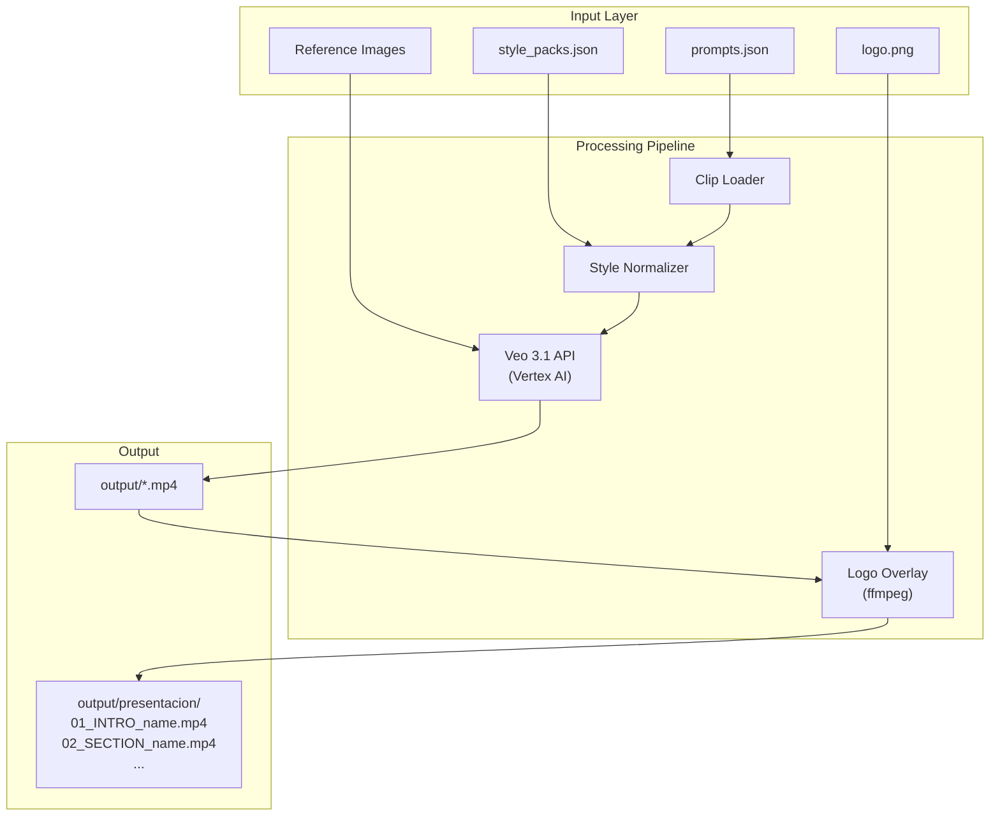

# Veo Video Pipeline

A structured video generation pipeline built on **Google Veo 3.1** (Vertex AI). Define your video as a sequence of clips in JSON, and the pipeline handles batch generation, visual consistency enforcement, logo overlays, and presentation-ready output with sequential naming.

Built for producing **corporate videos, product demos, and AI-generated visual narratives** from structured prompts — without touching a video editor until the final assembly.

## Features

- **JSON-driven clip definitions** — describe each clip's cinematography, subject, action, context, style, and audio in structured prompts
- **Batch generation** — generate all clips, a specific block, or individual clips by ID
- **Style packs** — enforce visual consistency across all clips with reusable style + negative prompt presets
- **Reference images** — anchor Veo's output to real photographs or generated reference frames for visual coherence
- **Presentation mode** — curate a subset of clips in narrative order, auto-sorted by `presentation_order`
- **Logo overlay** — apply a consistent brand logo to all generated videos via ffmpeg post-processing
- **Dependency-aware generation** — extract last frames from generated clips to use as start frames for the next
- **Dry-run mode** — preview everything without spending API credits
- **Variant generation** — generate up to 4 variants per clip and pick the best

## Architecture



## Quick Start

### Prerequisites

- Python 3.10+
- Google Cloud account with [Vertex AI enabled](https://console.cloud.google.com/vertex-ai)
- `gcloud` CLI ([install](https://cloud.google.com/sdk/docs/install))
- A GCS bucket for video storage

### 1. Clone and setup

```bash
git clone https://github.com/YOUR_USER/veo-video-pipeline.git
cd veo-video-pipeline

python -m venv .venv

# Windows
.venv\Scripts\activate
# Linux/Mac
source .venv/bin/activate

pip install -r requirements.txt
```

### 2. Authenticate with Google Cloud

```bash
gcloud auth login
gcloud auth application-default login
gcloud config set project YOUR_PROJECT_ID
gcloud auth application-default set-quota-project YOUR_PROJECT_ID
```

### 3. Configure environment

```bash
cp .env.example .env
# Edit .env with your project ID, region, and bucket name
```

| Variable     | Description                     | Example              |
|--------------|---------------------------------|----------------------|
| `PROJECT_ID` | Google Cloud project ID         | `my-gcp-project`    |
| `LOCATION`   | Vertex AI region                | `us-central1`       |
| `GCS_BUCKET` | GCS bucket (without `gs://`)    | `my-veo-bucket`     |

### 4. Create your prompts

Copy the example and customize:

```bash
cp input/prompts.example.json input/prompts.json
```

Each clip is a JSON object:

```json
{
  "clip_id": "clip_1_1a",
  "block": "Block 1 - Opening",
  "scene": "Scene 1.1 - Overview",
  "prompt": "Wide aerial shot of a modern facility...",
  "negative_prompt": "text on screen, watermark, face distortion",
  "duration": 8,
  "reference_image_path": "input/images/ref_aerial.jpg",
  "notes": ""
}
```

Clips can optionally include `presentation_order` and `presentation_section` fields to be included in presentation mode.

## Usage

### List all clips

```bash
python main.py --list

# Only presentation clips (narrative order)
python main.py --list --presentation
```

### Dry-run (no API calls, no cost)

```bash
python main.py --dry-run
python main.py --dry-run --presentation --style-pack corporate_clean
```

### Generate clips

```bash
# Single clip
python main.py --clips clip_1_1a --variants 1

# Entire block
python main.py --block "Block 1" --variants 1

# All presentation clips with style enforcement
python main.py --presentation --style-pack corporate_clean --variants 1

# Production run: 4 variants + logo + audio
python main.py --presentation --style-pack corporate_clean --variants 4 --logo-overlay --audio
```

### All options

| Flag | Description | Default |
|------|-------------|---------|
| `--list` | List clips and exit | |
| `--dry-run` | Preview without API calls | |
| `--clips IDS` | Filter by clip IDs (comma-separated) | all |
| `--block NAME` | Filter by block name | all |
| `--presentation` | Use curated presentation sequence | off |
| `--style-pack NAME` | Apply style pack for visual consistency | none |
| `--variants N` | Variants per clip (1-4) | 1 |
| `--audio` | Enable audio generation | off |
| `--logo-overlay` | Apply logo overlay (needs ffmpeg) | off |
| `--logo-path PATH` | Logo file path | `input/images/logo.png` |
| `--logo-position POS` | `top-left`, `top-right`, `bottom-left`, `bottom-right`, `center` | `bottom-right` |
| `--logo-scale N` | Logo scale relative to video width (0.0-1.0) | 0.08 |
| `--logo-opacity N` | Logo opacity (0.0-1.0) | 0.85 |
| `--logo-margin N` | Margin from edge in pixels | 30 |

## Style Packs

Style packs enforce visual consistency by appending a style suffix to every prompt and merging a base negative prompt (without duplicating existing restrictions).

Create your own in `style_packs.json`:

```bash
cp style_packs.example.json style_packs.json
```

```json
{
  "my_brand": {
    "style_suffix": "Consistent brand identity. Blue and white palette...",
    "negative_prompt_base": "text on screen, watermark, low quality..."
  }
}
```

If `style_packs.json` doesn't exist, a built-in `corporate_clean` pack is available.

## Presentation Mode

For curated video presentations, mark clips with `presentation_order` in your `prompts.json`:

```json
{
  "clip_id": "clip_3_1a",
  "presentation_order": 2,
  "presentation_section": "DIGITAL_TWIN",
  "presentation_adjustments": "Make contrast more pronounced"
}
```

Then generate only those clips in narrative order:

```bash
python main.py --presentation --style-pack corporate_clean --variants 1 --logo-overlay
```

A PowerShell orchestration script (`generate_presentation.ps1`) automates the full flow: dependency-aware generation, frame extraction, logo overlay, and final renaming to `output/presentacion/01_SECTION_name.mp4`.

## Logo Overlay

Overlay a consistent logo on every generated video. Requires **ffmpeg** — automatically detected from system PATH or from the `imageio-ffmpeg` Python package (installed via `requirements.txt`).

```bash
python main.py --clips clip_1_1a --variants 1 --logo-overlay --logo-position bottom-right --logo-scale 0.08
```

Output: `clip_1_1a.mp4` (original) + `clip_1_1a_logo.mp4` (with logo).

## Project Structure

```
veo-video-pipeline/
├── .env.example                 # Environment template
├── .gitignore
├── LICENSE
├── README.md
├── requirements.txt
├── main.py                      # Core pipeline
├── generate_presentation.ps1    # Orchestration script (Windows)
├── style_packs.example.json     # Style pack template
├── input/
│   ├── prompts.example.json     # Prompt structure template
│   ├── presentation_sequence.example.json
│   └── images/                  # Reference images and logo (gitignored)
└── output/                      # Generated videos (gitignored)
    └── presentacion/            # Final renamed sequence
```

## Veo 3.1 Specs

| Parameter       | Supported values         |
|-----------------|--------------------------|
| Format          | MP4                      |
| FPS             | 24                       |
| Resolution      | 720p, 1080p              |
| Aspect Ratio    | 16:9, 9:16               |
| Duration/clip   | 4, 6, or 8 seconds       |
| Max image input | 20 MB                    |
| Videos/prompt   | Up to 4                  |
| Prompt language | English                  |
| Rate limit      | 50 req/min/model         |

## Prompt Engineering Tips

Each prompt follows a 5-part formula for best results with Veo 3.1:

**[Camera movement] + [Subject] + [Action] + [Context/Setting] + [Style & Audio]**

- Lead with camera type and movement (e.g., "Slow dolly-in", "Wide aerial crane shot")
- One dominant action per clip
- Optimal length: 100-150 words (3-6 sentences)
- Include explicit audio description (Veo generates matching sound design)
- All on-screen text should be added in post-production (Veo doesn't reliably render text)
- Use negative prompts to avoid common artifacts

## License

MIT
