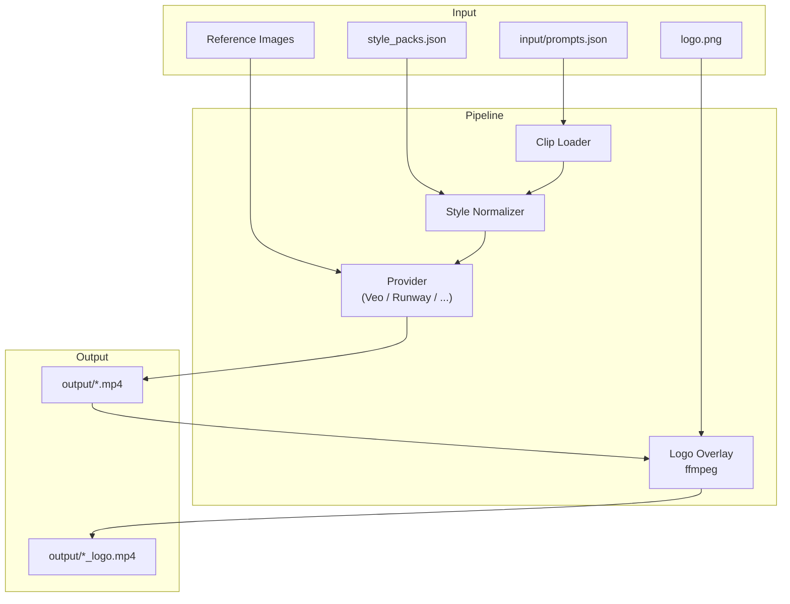

# ai-video-gen

**JSON-driven batch video generation from multiple AI providers.**

Define your video as a sequence of clips in a JSON file. The pipeline handles batch generation, visual consistency enforcement, logo overlays, and presentation-ready output — without touching a video editor until the final assembly.

[](https://www.python.org/downloads/)
[](LICENSE)
[](https://github.com/JuanLara18/ai-video-gen/pulls)

---

## Results

<table>
  <tr>
    <td align="center"><br/><sub>🌸 Spring — Cherry blossom rain</sub></td>
    <td align="center"><br/><sub>⛈️ Summer — Storm at the edge of the world</sub></td>
    <td align="center"><br/><sub>🍂 Autumn — Mirror lake at dawn</sub></td>
    <td align="center"><br/><sub>❄️ Winter — Aurora over the frozen forest</sub></td>
  </tr>
</table>

*All four clips generated with this pipeline using Google Veo 3.1 via Vertex AI.*

---

## Features

- **JSON-driven clips** — describe cinematography, subject, action, setting, and audio in structured prompts
- **Multi-provider** — pluggable provider architecture; currently ships with Google Veo (Vertex AI), with more providers coming
- **Batch generation** — generate all clips, a specific block, or individual clips by ID
- **Style packs** — enforce visual consistency across all clips with reusable style + negative-prompt presets
- **Reference images** — anchor the model's output to a real photo or a generated frame
- **Presentation mode** — curate a narrative clip sequence ordered by `presentation_order`
- **Logo overlay** — burn a PNG logo onto every generated video via ffmpeg post-processing
- **Variant generation** — generate up to 4 variants per clip and pick the best
- **Dry-run mode** — preview everything without spending API credits

---

## Supported Providers

| Provider | Flag | Status |
|----------|------|--------|
| Google Veo 3.1 (Vertex AI) | `--provider veo` | ✅ Available |
| Runway Gen-3 / Gen-4 | `--provider runway` | 🔜 Coming soon |
| Kling | `--provider kling` | 🔜 Coming soon |
| MiniMax / Hailuo | `--provider minimax` | 🔜 Coming soon |
| OpenAI Sora | `--provider sora` | 🔜 Coming soon |

Want to add a provider? See [docs/providers.md](docs/providers.md).

---

## Quick Start

### 1. Clone and install

```bash
git clone https://github.com/JuanLara18/ai-video-gen.git
cd ai-video-gen

python -m venv .venv
# Windows
.venv\Scripts\activate
# Linux / macOS
source .venv/bin/activate

pip install -e ".[veo]"
```

### 2. Authenticate with Google Cloud

```bash
gcloud auth login
gcloud auth application-default login
gcloud config set project YOUR_PROJECT_ID
gcloud auth application-default set-quota-project YOUR_PROJECT_ID
```

### 3. Configure environment

```bash
cp .env.example .env
# Edit .env with your project ID, region, and bucket name
```

### 4. Create your prompts

```bash
cp examples/prompts.example.json input/prompts.json
# Edit input/prompts.json with your clip descriptions
```

### 5. Generate

```bash
# Preview without API calls
python main.py --dry-run

# Generate a single clip
python main.py --clips clip_1_1a --variants 1

# Full production run
python main.py --presentation --style-pack corporate_clean --variants 4 --logo-overlay --audio
```

---

## Usage

```bash
# List all clips
python main.py --list

# List only presentation clips in narrative order
python main.py --list --presentation

# Generate an entire block with 2 variants
python main.py --block "Block 1" --variants 2

# Apply a style pack for visual consistency
python main.py --presentation --style-pack corporate_clean --variants 1

# With logo overlay
python main.py --clips clip_1_1a --logo-overlay --logo-position bottom-right --logo-scale 0.08
```

### All options

| Flag | Description | Default |
|------|-------------|---------|
| `--dry-run` | Preview without API calls | |
| `--list` | List clips and exit | |
| `--clips IDS` | Comma-separated clip IDs to generate | all |
| `--block NAME` | Filter by block name | all |
| `--presentation` | Use curated presentation sequence | off |
| `--provider NAME` | Video generation provider | `veo` |
| `--style-pack NAME` | Apply style pack for visual consistency | none |
| `--variants N` | Variants per clip (1–4) | `1` |
| `--audio` | Enable audio generation | off |
| `--logo-overlay` | Apply logo overlay (needs ffmpeg) | off |
| `--logo-path PATH` | Logo file path | `input/images/logo.png` |
| `--logo-position POS` | `top-left`, `top-right`, `bottom-left`, `bottom-right`, `center` | `bottom-right` |
| `--logo-scale N` | Logo scale relative to video width (0.0–1.0) | `0.08` |
| `--logo-opacity N` | Logo opacity (0.0–1.0) | `0.85` |
| `--logo-margin N` | Margin from edge in pixels | `30` |

---

## Prompt Structure

Each clip in `input/prompts.json` follows this pattern:

```json
{
  "clip_id": "clip_1_1a",
  "block": "Block 1 - Opening",
  "scene": "Scene 1.1 - The facility",
  "prompt": "Wide aerial crane shot slowly descending over a modern facility...",
  "negative_prompt": "text on screen, watermark, face distortion",
  "duration": 8,
  "aspect_ratio": "16:9",
  "reference_image_path": "input/images/ref_aerial.jpg",
  "notes": "Use real aerial photo as start frame",
  "presentation_order": 1,
  "presentation_section": "INTRO"
}
```

See [docs/prompt-engineering.md](docs/prompt-engineering.md) for tips on writing prompts that produce better results.

---

## Project Structure

```
ai-video-gen/
├── ai_video_gen/
│   ├── cli.py              # CLI entrypoint
│   ├── config.py           # Environment variables and defaults
│   ├── pipeline.py         # Clip loading, filtering, style packs
│   ├── postprocess.py      # Logo overlay, GIF conversion (ffmpeg)
│   ├── utils.py            # Shared helpers
│   └── providers/
│       ├── base.py         # BaseProvider abstract class
│       └── veo.py          # Google Veo implementation
├── docs/                   # Detailed documentation
├── examples/               # Example JSON files to copy and customise
├── assets/                 # Demo GIFs for this README
├── input/                  # Your prompts and reference images (gitignored)
├── output/                 # Generated videos (gitignored)
├── .env.example
├── pyproject.toml
└── main.py                 # Thin entrypoint
```

---

## Documentation

| Topic | Link |
|-------|------|
| Full setup guide | [docs/getting-started.md](docs/getting-started.md) |
| Adding a new provider | [docs/providers.md](docs/providers.md) |
| Style packs | [docs/style-packs.md](docs/style-packs.md) |
| Prompt engineering tips | [docs/prompt-engineering.md](docs/prompt-engineering.md) |
| Presentation mode | [docs/presentation-mode.md](docs/presentation-mode.md) |

---

## Architecture



---

## Contributing

Contributions are welcome — especially new provider implementations.

1. Fork the repository
2. Create a feature branch: `git checkout -b feature/my-provider`
3. Implement your changes (see [docs/providers.md](docs/providers.md) for the provider guide)
4. Open a pull request

---

## License

MIT — see [LICENSE](LICENSE).
