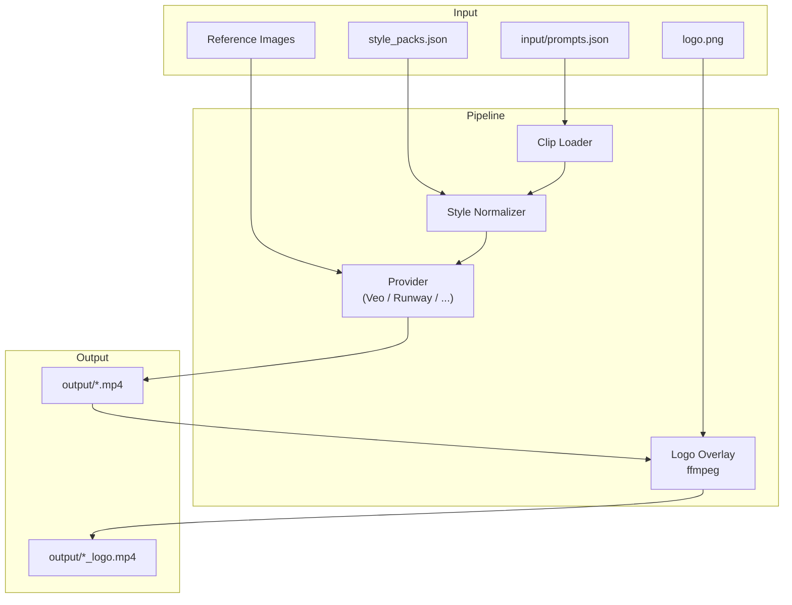

# Getting Started

This guide walks you through setting up **ai-video-gen** and generating your first video clip.

---

## Prerequisites

| Requirement | Notes |
|-------------|-------|
| Python 3.10+ | Check with `python --version` |
| ffmpeg | Optional — only needed for logo overlay. Auto-detected from PATH or via `imageio-ffmpeg` |
| A supported provider account | See [providers.md](providers.md) |

---

## Installation

### 1. Clone the repository

```bash
git clone https://github.com/JuanLara18/ai-video-gen.git
cd ai-video-gen
```

### 2. Create a virtual environment

```bash
python -m venv .venv

# Windows
.venv\Scripts\activate
# Linux / macOS
source .venv/bin/activate
```

### 3. Install dependencies

Base package (no provider yet):

```bash
pip install -e .
```

With Google Veo support:

```bash
pip install -e ".[veo]"
```

With everything:

```bash
pip install -e ".[all]"
```

---

## Setting Up Google Veo (Vertex AI)

### Authenticate with Google Cloud

```bash
gcloud auth login
gcloud auth application-default login
gcloud config set project YOUR_PROJECT_ID
gcloud auth application-default set-quota-project YOUR_PROJECT_ID
```

### Create a GCS bucket

Veo writes output videos to Google Cloud Storage. Create a bucket if you don't have one:

```bash
gcloud storage buckets create gs://your-bucket-name --location=us-central1
```

### Configure environment variables

```bash
cp .env.example .env
```

Edit `.env`:

```env
PROJECT_ID=your-gcp-project-id
LOCATION=us-central1
GCS_BUCKET=your-bucket-name
```

---

## Creating Your Prompts

Copy the example and customise it:

```bash
cp examples/prompts.example.json input/prompts.json
```

Each clip is a JSON object with these fields:

| Field | Required | Description |
|-------|----------|-------------|
| `clip_id` | Yes | Unique identifier (used for output file naming) |
| `block` | Yes | Group name for organising clips |
| `scene` | Yes | Human-readable scene description |
| `prompt` | Yes | Text description of the video |
| `duration` | Yes | Clip length in seconds (4, 6, or 8) |
| `negative_prompt` | No | Things to avoid in the output |
| `aspect_ratio` | No | `"16:9"` (default) or `"9:16"` |
| `reference_image_path` | No | Path to a reference/start-frame image |
| `notes` | No | Internal notes (not sent to the API) |
| `presentation_order` | No | Integer; marks this clip for presentation mode |
| `presentation_section` | No | Section label used in presentation mode |
| `presentation_adjustments` | No | Human notes for last-minute adjustments |

---

## Generating Videos

### Preview without API calls

```bash
python main.py --dry-run
```

### Generate a single clip

```bash
python main.py --clips clip_1_1a --variants 1
```

### Generate all clips in a block

```bash
python main.py --block "Block 1" --variants 1
```

### Full production run

```bash
python main.py --presentation --style-pack corporate_clean --variants 4 --logo-overlay --audio
```

---

## Output

Generated videos are saved to `output/`:

```
output/
├── clip_1_1a.mp4
├── clip_1_1a_logo.mp4     # if --logo-overlay was used
├── clip_1_1b_v1.mp4       # if --variants > 1
├── clip_1_1b_v2.mp4
└── ...
```

---

---

## All CLI Options

| Flag | Description | Default |
|------|-------------|---------|
| `--dry-run` | Preview without API calls | |
| `--list` | List clips and exit | |
| `--clips IDS` | Comma-separated clip IDs to generate | all |
| `--block NAME` | Filter by block name | all |
| `--presentation` | Use curated presentation sequence | off |
| `--provider NAME` | Video generation provider | `veo` |
| `--style-pack NAME` | Apply style pack for visual consistency | none |
| `--variants N` | Variants per clip (1–4) | `1` |
| `--audio` | Enable audio generation | off |
| `--logo-overlay` | Apply logo overlay (needs ffmpeg) | off |
| `--logo-path PATH` | Logo file path | `input/images/logo.png` |
| `--logo-position POS` | `top-left`, `top-right`, `bottom-left`, `bottom-right`, `center` | `bottom-right` |
| `--logo-scale N` | Logo scale relative to video width (0.0–1.0) | `0.08` |
| `--logo-opacity N` | Logo opacity (0.0–1.0) | `0.85` |
| `--logo-margin N` | Margin from edge in pixels | `30` |

---

## Prompt Structure

Each clip in `input/prompts.json` follows this schema:

```json
{
  "clip_id": "clip_1_1a",
  "block": "Block 1 - Opening",
  "scene": "Scene 1.1 - The facility",
  "prompt": "Wide aerial crane shot slowly descending over a modern facility...",
  "negative_prompt": "text on screen, watermark, face distortion",
  "duration": 8,
  "aspect_ratio": "16:9",
  "reference_image_path": "input/images/ref_aerial.jpg",
  "notes": "Internal note — not sent to the API",
  "presentation_order": 1,
  "presentation_section": "INTRO",
  "presentation_adjustments": "Increase contrast"
}
```

See [prompt-engineering.md](prompt-engineering.md) for tips on writing effective prompts.

---

## Project Structure

```
ai-video-gen/
├── ai_video_gen/
│   ├── cli.py              # CLI entrypoint
│   ├── config.py           # Environment variables and defaults
│   ├── pipeline.py         # Clip loading, filtering, style packs
│   ├── postprocess.py      # Logo overlay, GIF conversion (ffmpeg)
│   ├── utils.py            # Shared helpers
│   └── providers/
│       ├── base.py         # BaseProvider abstract class
│       └── veo.py          # Google Veo implementation
├── docs/                   # Detailed documentation
├── examples/               # Example JSON files to copy and customise
├── assets/                 # Demo GIFs
├── input/                  # Your prompts and reference images (gitignored)
├── output/                 # Generated videos (gitignored)
├── .env.example
├── pyproject.toml
└── main.py                 # Thin entrypoint
```

---

## Architecture



---

## Next Steps

- [Style Packs](style-packs.md) — enforce visual consistency across all clips
- [Prompt Engineering](prompt-engineering.md) — write prompts that get better results
- [Presentation Mode](presentation-mode.md) — curate a narrative clip sequence
- [Providers](providers.md) — add support for other video generation models
